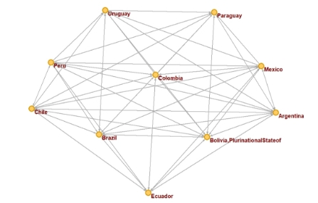
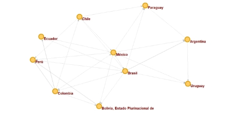

**Análisis estructural de las redes de mercado de combustibles fósiles y biocombustibles entre los países pertenecientes a ALADI**

## RESUMEN

El objetivo de este artículo es comparar el mercado de combustible fósil con biocombustible, a través de un análisis de redes sociales para los países miembros de la ALADI (Asociación Latinoamericana de Integración), con lo cual se mostrarán las diferencias y similitudes de estos mercados. Se analizó el comportamiento para cada uno de los 10 países, dando como resultado a Brasil como uno de los principales productores en temas como consumo, producción y exportación para los combustibles tomados en cuenta y a Argentina como un punto de influencia en ambos mercados.

**Palabras clave**: *Exportaciones – Redes sociales – CO2 – Biocombustibles – Combustibles fósiles.*

## ABSTRACT

The objective of this article is to compare the fossil fuel market with biofuel, through a social network analysis for the member countries of ALADI (Latin American Integration Association), which will show the differences and similarities of these markets. The behavior for each of the 10 countries was analyzed, resulting in Brazil as one of the main producers in consumption, production and export for each of the fuels and Argentina as a point of influence in both markets.

**Key words**: *Exports – Social Networks – CO2 – Biofuel – Fossil Fuel.*

Milgram & Granovetter, Vol.26, #1, 2015, 267-292

## INTRODUCCIÓN

La relación entre la actividad económica y la degradación ambiental ha sido ampliamente estudiada en el marco de la economía ambiental, convirtiéndose en uno de los temas más abordados por dicha disciplina en los pasados 20 años (Ahmed, Ozturk, Ghumro & Mukesh, 2019). Especialmente, el crecimiento exponencial de la población humana y la carrera entre las economías mundiales para lograr un crecimiento económico acelerado han provocado que el consumo de recursos naturales sea más rápido de lo que puede recuperar, afectando negativamente la calidad ambiental global más que nunca en la historia de la humanidad (Ling, 2017).

Por otra parte, los paises con economias en desarrollo y emergentes como las latinoamericanas que están orientadas a la exportación y que enfrentan desafios en torno al costo económico relacionado al cuidado Ambiental y la existe una gran parte del valor de las exportaciones en la producción de bienes intensivos en carbono (Peters & Hertwich 2008; Halicioglu & Ketenci 2016). Además, muchas de las economías en desarrollo temen que la administración del cambio climático tenga inversiones deficientes y que el valor agregado industrial se traslade progresivamente a aquellas naciones que no participan en el régimen del cambio climático (Peters et al. 2007). 

Adicionalmente, el gobierno de estos ecosistemas es inherentemente difícil ya que tanto el medio ambiente natural como las sociedades humanas se caracterizan por incertidumbres, dinámicas complejas, variaciones naturales y dependencias de escala (por ejemplo, Levin, 1998; Berkes, 2003). Muchos de los servicios que brindan son recursos comunes con múltiples actores que compiten por su uso, lo que a menudo conduce al agotamiento de recursos o conflictos de gestión (Hardin, 1968).

La investigación reciente ha identificado la existencia de redes sociales como un denominador común e importante en los casos en que diferentes partes interesadas se han unido para tratar eficazmente los problemas y dilemas de los recursos naturales (por ejemplo, Gunderson, 1999; Hahn, 2006; Folke, 2005; Pretty & Ward, 2001; Olsson, 2008; Grafton, 2005; Scholz & Wang, 2006). Incluso se ha demostrado que las redes sociales pueden ser más importantes que la existencia de instituciones formales para la aplicación efectiva y el cumplimiento de las regulaciones ambientales (Scholz y Wang, 2006). Las redes sociales pueden mejorar los procesos de gobernanza colaborativa al facilitar:

- La generación, adquisición y difusión de diferentes tipos de conocimiento.
- Lograr la movilización y asignación de recursos clave para una gobernanza efectiva
- Generando reglas communes entre los actores que fomentan la voluntad de participar programas de monitoreo y sanción 
- Resolución de conflictos. 

Sin embargo, no todas las redes sociales son iguales; por el contrario, el patrón estructural de las relaciones (es decir, la topología) de una red social puede tener un impacto significativo en cómo se comportan realmente los actores (Degenne & Forse, 1999).

Por lo que estudio busca lograr comprar los mercados de combustibles fósiles y biocombustibles en para los países miembros de ALADI. Por medio, de la exploración de las redes sociales que se forman por la exportación de dichos productos con el fin de entender cuáles son los principales actores (países) en estos mercados y como estos pueden contribuir en una transición a economías más limpias. 

## MARCO TEORICO

Para el abordaje del referente teórico en este artículo, a continuación, se revisa la producción y exportación de combustibles fósiles y bio combustibles, al igual que las emisiones de CO2 en países miembros de ALADI.

Combustibles fosiles

Se agrupan bajo esta denominación el carbón, el petróleo y el gas natural, productos que son altamente explotados en la economía latinoamericana, la cual basa parte significativa de su renta en la explotación de dichos productos (Vives & Millan, 2000). Principalmente la Región Andina (Venezuela, Colombia, Ecuador, Perú y Bolivia) se encuentran las reservas principales y los países productores más representativos de combustibles fósiles en toda América Latina. En 2013 las reservas de petróleo, gas natural y carbón se estimaron en 54.931 millones de toneladas equivalentes de petróleo, equivalentes al 11% de las reservas de América Latina. En el mismo año la producción de combustibles fósiles fue de 375 millones, correspondiendo con el 45% de América Latina (OLADE, 2015).

Sin embargo, esta economía no está fundada en un modelo económico financiero y ambiental sostenible, sino que, es un sector competitivo, con una alta participación privada el cual carece de mecanismos de control de los cambios en el uso de la tierra, que permiten la deforestación de grandes extensiones para afectar las tierras para producción agrícola y pastoreo (Zilio, 2011). En este contexto, el análisis de la relación entre la explotación y comercio de combustibles fósiles y producción de CO2 resulta relevante por tres razones: en primer lugar, porque los senderos de CO2 en la región han experimentado un marcado crecimiento en los años recientes, en contraposición a la disminución observada en los países desarrollados. En segundo lugar, porque las metas de reducción de emisiones establecidas en los países desarrollados no tienen sentido alguno si sólo generan un desplazamiento de actividades contaminantes desde esos países hacia los menos desarrollados y porque la política climática debe estar orientada primordialmente a atenuar los efectos del cambio climático en los países y sectores en condición de marcada vulnerabilidad, que son precisamente los que gozan de menores posibilidades de adaptación (Zilio & Angeles, 2014) 

Biocombustibles

Los combustibles biológicos son obtenidos de manera renovable a partir de restos orgánicos (González y Valero, 2011). Entre los principales biocombustibles de se encuentran el bioetanol, el biodiésel y el biogás. La producción de etanol deriva de las biomasas de los cultivos energéticos de maíz, sorgo, yuca y caña de azúcar, entre otros; el biodiésel se produce a partir de las oleaginosas de la soya, aceite de palma, colza, etc., y el biogás se obtiene a partir de residuos orgánicos mediante procesos de digestión anaerobia (Torres y Hernández, 2006).

En América Latina la producción de biocombustibles es liderada por Brasil, Argentina y Colombia, según datos del último estudio sobre biocombustibles publicado por la Comisión Económica para América Latina y el Caribe (CEPAL), y se ha convertido en la mejor opción de fuente energética para competir con el petróleo (Gomez, 2016). En América Latina el mayor interés en los biocombustibles se tiene en la fabricación de bioetanol, con una producción cercana a los 26,3 billones de litros, con una participación de Brasil (34,2%), seguido de Colombia (0,4%) y nula acción de Argentina. En este sentido se evidencia el buen desempeño de Latinoamérica cuando se compara con Estados Unidos, que encabeza la producción con el 54% (REN21, 2009). 

Emisiones de CO2

La Organización de las Naciones Unidas para la Alimentación y la Agricultura (FAO) en el taller sobre los gases de efecto invernadero (GEI) muestran que las emisiones en Latinoamérica se han duplicado en los últimos años y seguirán aumentando si no se lleva a cabo un esfuerzo mayor para reducirlas. Estas emisiones superaron los 785 millones de toneladas de CO2 en 2010, con un crecimiento del 75 por ciento desde 1990 (FAO, 2014).

Según la base de datos FAOSTAT, las emisiones agrícolas en la región latinoamericana crecieron de 388 millones de toneladas de equivalentes de CO2 en 1961, a más de 900 millones de toneladas en 2010. Las emisiones netas forestales y las asociadas mostraron una fuerte disminución en los últimos años, quedando en promedio alrededor de unos 1500 millones de toneladas durante el 2000 (Ochoa, Sanchez, Carrion & Torre, 2019).

Un aporte al estudio del cambio climático de Zilio (2008), Emisiones de dióxido de carbono en América Latina, señala que las mayores concentraciones de gases de efecto invernadero en la troposfera provienen de la actividad humana. En este contexto, las emisiones de dióxido de carbono (CO2) juegan un rol preponderante, puesto que son la principal causa del calentamiento global. Más escasos estudios han sido los realizados específicamente para América Latina y el Caribe. En este sentido cabe mencionar los estudios para América Latina de; Correa et al., (2005) para Colombia; y, Lipford y

Yandle, (2010) para México (Ochoa, Sanchez, Carrion & Torre, 2019).

## MÉTODO

Este estudio tiene como objetivo el análisis estructural de las redes de exportaciones e importaciones de combustible fósiles y biocombustibles de los países que conforman la ALADI, a fin de identificar y comparar la dinámica de estos dos mercados y su relación con variables externas como las emisiones CO2 per cápita de cada país.

Las redes son representadas por grafos dirigidos, donde los nodos son los países estudiados y las aristas indica la existencia de exportaciones de un país origen a otro destino. Para este estudio el valor neto de las exportaciones fue normalizado (Z-Score) y asignado como peso al enlace.

Este estudio se basa análisis estructural de redes (Beauchamp '65, Freeman '79 y Bonacich '72) de donde analizaremos las métricas al nivel de grafo densidad y coeficiente de cohesión Watts-Strogatz y métricas a nivel de nodo como son grado, cercanía, intermediación e influencia.

**Densidad**: Indica el número de enlaces existentes de todos los posibles. Para este estudio indica el grado de comercialización de la red.

**Coeficiente de Cohesión Watts-Strogatz**: Esta es la medida del grado en que los nodos tienen a agruparse dada la densidad de los enlaces. En este estudio indica que tan alto es la conexión dentro de la red.

**Grado Ponderado**: Esta métrica indica las relaciones directas de un nodo con sus vecinos, dado que representaremos las redes con dos grafos dirigidos se evaluará esta medida en cada dirección de salida y, de entrada. La característica ponderada indica que se tiene en cuenta el peso del enlace para su cálculo. Para este estudio el grado de salida indica la capacidad productora y exportadora del país del producto analizado y el grado de entrada indica la demanda del país del tipo de combustible analizado.

**Intermediación**: Esta métrica indica la frecuencia en que un nodo hace parte de la ruta más corta entre los otros nodos del grafo. Para nuestro estudio indicaría la capacidad que tiene un pais para controlar las exportaciones e importaciones de los combustibles, dada su capacidad de comunicación con los demás países.

**Cercanía**: Esta métrica busca determinar el promedio de la ruta más corta del nodo a todos los demás. Dado que estamos generando redes con grafos dirigidos, tenemos cercanía de entrada y de salida, la primera para este estudio representa la accesibilidad de país al mercado de combustibles analizado y la de salida su fortaleza como productor. Dado que no temenos un detalle sobre si los productos importados por un país B desde un país A hacen parte los productos que este país B exporta a un tercer país C, no analizaremos esta medida como distancia de propagación sino como un concepto más asociado al alcance que tiene cada nodo dentro de la red, muy cercano al grado.

**Influencia**: Esta métrica indica que tan conectado se encuentra un nodo a los nodos mejores conectados de la red. Para el análisis la medida indica cuales son los países líderes del mercado.

La generación de las métricas se realiza utilizando la formulación existente para estas en la aplicación de Pajek64 5.08. 

Como un primer desarrollo se generan las redes de exportaciones país origen a país destino con los respectivos pesos normalizados de cada transacción. Seguido se generan las métricas para las redes de exportación de combustibles fósiles y de biocombustibles, se realiza un análisis comparativo entre estas dos redes identificado los líderes y principales socios comerciales en cada mercado y finalmente se desarrolla un análisis descriptivo del comportamiento de cada red contra variables externas como es las emisiones de CO2.

Participantes

El estudio se centra en los países miembros de ALADI (Asociación Latinoamericana de Integración) esta es el mayor grupo de integración conformado por 13 países, Argentina, Bolivia, Brasil, Chile, Colombia, Cuba, Ecuador, México, Panamá, Paraguay, Perú, Uruguay y Venezuela, representando en conjunto 20 millones de kilómetros cuadrados y más de 510 millones de habitantes.​ Debido a la disponibilidad de los datos para el periodo del estudio se excluyó 3 países, Cuba, Panamá y Venezuela; por lo tanto el estudio se desarrolla sobre los 10 países restantes.

Instrumentos

la fuente de estos datos son cálculos del ITC basados en estadísticas de UN COMTRADE y del ITC. El ITC (International Trade Centre) es una organización impulsada por la ONU y la Organización Mundial del Comercio y el UN COMTRADE (United Nations International Trade Statistics Database) es una organización que reúne la información de exportaciones detallada por categoría de alrededor de 170 países que de manera anual se reporte a la división de estadística de las Naciones Unidas (UNSD). Se filtraron los datos correspondientes para los países miembros de ALADI para el año 2018 seleccionando los productos de Combustibles Fósiles (código en Trade Map: *27 Combustibles minerales, aceites minerales y productos de su destilación; materias bituminosas; ceras minerales.)* y Biocombustibles (*código en Trade Map: Producto General 29: Productos químicos orgánicos. Se usará dos subcategorías de dicho producto: 2901 Hidrocarburos acíclicos y 2902 Hidrocarburos cíclicos*).

Se genera las redes de exportaciones mediante excel2pajek y posteriormente se edita el archivo para incluir los pesos (valor de las exportaciones) normalizados. La red se crea como dirigida.

La visualización de la red y la generación de las métricas se utilizó el software Pajek64 5.08. 

## RESULTADOS

Descripción de la red de exportaciones de combustibles fósiles en los países pertenecientes a ALADI

La figura 1 muestra la red de las exportaciones de productos fósiles entre los paises incluidos en el estudio.

Se observa una red altamente interconectada, no se observa nodos aliados y los 10 países son tanto exportadores como importadores.

La tabla 1 muestra los indicadores globales de la red, basados en la densidad de 0.76 y el coeficiente de cohesión del 0.85 vemos que es una red altamente interconectada, es decir el flujo de intercambios comerciales el alto entre todos los países miembros.

**Tabla 1** 

*Indicadores globales red exportaciones de combustibles fósiles*

|**Número de Vertices** |**Número de Arcos**|**Densidad**|**Coheficiente de Cohesión Watts-Strogatz**|
| :-: | :-: | :-: | :-: |
|10|76|0\.76|0\.85|

` `**Gráfico 1**. Red de exportación de combustibles fósiles.

A continuación, presentamos los indicadores estructurales de la red a nivel de nodo. 

**Tabla 2** 

*Indicadores red exportaciones de combustibles fósiles*

|**País**|**Grado Entrada**|**Grado Salida**|**Intermediación**|**Cercania Entrada**|**Cercania Salida**|**Influencia**|
| :-: | :-: | :-: | :-: | :-: | :-: | :-: |
|**Brazil**|6\.95|3\.31|0\.05|0\.90|1\.00|0\.60|
|**Chile**|6\.26|-3.51|0\.01|0\.82|0\.90|-0.64|
|**Paraguay**|-3.21|3\.22|0\.00|0\.90|0\.60|-0.01|
|**Ecuador**|-2.72|2\.56|0\.00|0\.82|0\.75|0\.00|
|**Colombia**|-2.60|2\.03|0\.01|0\.82|1\.00|0\.02|
|**Bolivia**|-3.69|2\.33|0\.06|1\.00|1\.00|0\.04|
|**Argentina**|0\.47|-2.10|0\.06|1\.00|1\.00|0\.32|
|**Uruguay**|-0.40|-1.52|0\.00|0\.82|0\.64|-0.33|
|**Peru**|0\.09|-2.40|0\.01|0\.82|1\.00|-0.13|
|**Mexico**|-0.97|-3.72|0\.01|0\.75|1\.00|0\.03|

La red de comercio de combustibles fósiles de los países pertenecientes a ALADI muestra como principales países consumidores a Brasil y Chile esto se puede evidenciar al ser los dos países con el mayor grado de entrada superior a 6 muy por encima de los demás socios. Brasil es a su vez el mayor productor y exportador de combustibles fósiles con un grado de salida de 3.31, por lo anterior este país se convierte el principal socio de este mercado. Tenemos países con importante capacidad exportadora, pero que generan baja demanda de los productos como son Ecuador, Bolivia y Paraguay y en contra parte Chile que tiene una alta demanda de los productos, pero baja capacidad de exportación.

En cuanto a la capacidad de controlar el mercado vemos que Argentina y Bolivia son los países mejor calificados para esto, ya que están presentes en la mayoría de las relaciones comerciales del mercado. En este escenario Brasil sigue siendo un país líder, su valor de intermediación es muy cercano al de Argentina y Bolivia ubicándose en tercer lugar.

Los países de mayor accesibilidad a los productos son nuevamente Argentina y Bolivia, su cercanía de entrada el de 1. En cuanto a la accesibilidad a los compradores del mercado nuevamente aparecen los dos países anteriores acompañados de Brasil, Colombia, México y Perú; este alto número de países compartiendo el primer lugar en cercanía de salida solo confirma el alto grado de cohesión en la red.

Finalmente, los países líderes del mercado y más fuertemente relacionados son en su orden Brasil, Argentina y Bolivia. Brasil es un país muy fuerte tanto en el rol productor como consumidor, por otra parte, vemos en Argentina un país con relativa importancia consumidora más no así productora y finalmente Bolivia de importancia productora y baja relevancia como consumidor, no obstante, sus diferencias de rol son estos tres países los que están en la capacidad de controlar y regular el mercado de los productos fósiles dentro de los países de ALADI.

Descripción de la red de exportaciones de biocombustibles en los países pertenecientes a ALADI

La figura 2 muestra la red de las exportaciones de biocombustibles entre los países miembros de ALADI. 

Para esta red vemos los 10 países son importadores de biocombustibles sin embargo los países exportares son solo un subgrupo de estos.

En la table 3 vemos los indicadores globales de la red, para este mercado tenemos una cohesión media en la red del 0.56 y una baja densidad del 0.3, lo anterior explicado por la presencia del rol exportador en solo 6 de los 10 países.

**Tabla 3** 

*Indicadores globales red exportaciones de biocombustibles*

|**Número de Vertices** |**Número de Arcos**|**Densidad**|**Coheficiente de Cohesión Watts-Strogatz**|
| :-: | :-: | :-: | :-: |
|10|30|0\.30|0\.56|

**Gráfico 2**. Red de exportación de biocombustibles.

A continuación, presentamos los indicadores estructurales de la red a nivel de nodo.

**Tabla 4** 

*Indicadores red exportaciones de biocombustibles*

|**País**|**Grado Entrada**|**Grado Salida**|**Intermediación**|**Cercania Entrada**|**Cercania Salida**|**Influencia**|
| :-: | :-: | :-: | :-: | :-: | :-: | :-: |
|**Brasil**|-0.38|4\.61|0\.02|0\.30|1\.00|0\.00|
|**Argentina**|3\.53|-0.73|0\.00|0\.33|0\.30|0\.76|
|**México**|2\.77|-2.77|0\.10|0\.40|1\.00|0\.63|
|**Ecuador**|-0.12|0\.00|0\.00|0\.40|0\.00|-0.08|
|**Perú**|-0.42|0\.00|0\.00|0\.60|0\.00|-0.08|
|**Bolivia,**|-1.12|0\.11|0\.00|0\.40|0\.20|-0.07|
|**Uruguay**|-1.05|0\.00|0\.00|0\.43|0\.00|-0.06|
|**Colombia**|-0.74|-0.43|0\.00|0\.30|0\.75|-0.07|
|**Paraguay**|-1.45|0\.00|0\.00|0\.50|0\.00|-0.06|
|**Chile**|-1.02|-0.79|0\.00|0\.40|0\.60|-0.06|

En el mercado de biocombustibles entre los países de la ALADI tiene un claro país productor y exportador que es Brasil con 4.61 de centralidad de salida mientras el Segundo Bolivia tiene solo 0.11. En cuanto a los países generadores de demanda de biocombustibles los líderes son Argentina y México. 

El análisis de la capacidad de intermediación en la red, solo existen dos países con algún factor de control de la comunicación que serían México y Brasil. 

En cuanto a la accesibilidad de los países a los socios productores vemos cierta homogeneidad en los valores de cercanía de entrada lo que sugiere un contacto directo de los países consumidores de biocombustibles hacia los exportadores. Referente a la accesibilidad de los países exportadores hacia sus mercados vemos dos claros líderes que mantienen relación con todos los demás países del estudio y Brasil y México con una cercanía de salida de 1. Los países con cercanía de salida cero no tienen actividad de exportación de biocombustibles.

Finalmente, los países mejor relacionados y con la mayor influencia en el mercado son Argentina y México.

La comercialización de Biocombustibles entre los países de LAIA tiene 3 notorios líderes; Brasil, Argentina y México, siendo el primero el país productor dominante y los segundos los generadores de la mayor demanda.

## DISCUSIÓN

Con respecto al país que tiene una mayor interacción con cada uno de los combustibles, se observa que Brasil es de los más activos en temas de consumo, producción y exportación; la gran participación de este país está relacionada con varios factores demográficos, al ser el país con la mayor cantidad de población y geográficos, debido a ser uno de los de mayor extensión territorial con respecto a los demás países de la ALADI. Es importante mencionar que, aunque sea uno de los principales productores y exportadores, se ven oportunidades de mejora a la hora de controlar el mercado de estos combustibles.

Por otra parte, es importante resaltar la labor de Argentina debido a que este es un gran consumidor de los combustibles, lo cual lo hace un país de gran influencia comercial con respecto a los países de la ALADI. 

Con respecto a los demás países, no hay una relación tan fuerte con respecto a los dos tipos de combustibles, ya que un país como Bolivia es un punto de influencia en el mercado de combustible fósil, mientras que México lo es con biocombustibles. Los países restantes suelen tener indicadores bajos, los cuales no permiten identificar similitudes entre el mercado de ambos combustibles.

Finalmente, se destaca el hecho que todos los países de la ALADI son importadores de alguna manera de combustible fósil, mientras que esta situación no se presenta con el biocombustible, esto debido al poco impacto en el mercado que tienen este tipo de combustibles en cada uno de esos países.

## REFERENCIAS

**Ahmed, K., Ozturk, I., Ghumro, I. & Mukesh, P. (2019).** Effect of trade on ecological quality: a case of D-8 countries. *Environ Sci Pollut*, 26, 35935–35944.

**Bodin, Ö., & Crona, B. (2009).** The role of social networks in natural resource governance: What relational patterns make a difference? *Global Environmental Cohange, 19*, 366–374. 

**Bodin, Ö., & Prell, C. (2011).** *Social networks and natural resource management. Uncovering the social fabric of environmental governance.*** New York, NY: Cambridge University Press.

**Brandes, U., Lerner, J., Lubbers, M. J., McCarty, C., & Molina, J. L. (2008, March).** *Visual statistics for collections of clustered graphs*. Paper presented at 2008 IEEE Pacific Visualization Symposium, Kyoto, Japan.

**Berkes, F., Folke, C., & Colding, J. (2003).** Navigating Social–Ecological Systems: Building Resilience for Complexity and Change. *Cambridge University Press.*

**Casilda, R. (2002).** Energía y desarrollo económico en América Latina. *Boletin económico ICE*, 2750, 31- 43.

**Degenne, A., Forse´, M., (1999). Introducing** Social Networks. *Sage Publications*, London.

**Domínguez, S., & Hollstein, B. (Eds.). (2014).** *Mixed methods social network research: Design and applications*. New York, NY: Cambridge University Press. 

**FAO. (2014).** FAO - Noticias: Aumentan las emisiones de gases de efecto invernadero de la agricultura. *Organización de las Naciones Unidas para la Alimentación y la Agricultura*.  Roma. 

**Folke, C., Hahn, T., Olsson, P. & Norberg, J., (2005).** Adaptive governance of social–ecological systems. *Annual Review of Environment and Resources,* 30, 441–473.

**González, J. y Valero, E. (2011).** Energía y desarrollo humano. Un acercamiento a los biocombustibles. *Revista Electrónica Inte*c, 1(2), 66–84.

**Grafton, R.Q., (2005).** Social capital and fisheries governance. *Ocean and Coastal Management*, 48, 753–766.

**Gunderson, L.H., (1999).** Resilience, flexibility and adaptive management—antidotes for spurious certitude*? Conservation Ecology* 3.

**Hahn, T., Olsson, P., Folke, C. & Johansson, K., (2006).** Trust-building, Knowledge generation and organizational innovations: the role of a bridging organization for adaptive comanagement of a wetland landscape around Kristianstad, *Sweden. Human Ecology,* 34, 573–592.

**Halicioglu, F. & Ketenci, N. (2016).** The impact of international trade on environmental quality: the case of transition countries. *Energy,* 109, 1130–1138.

**Hardin, G., (1968)**. The tragedy of the commons. *Science*, 162, 1243–1248.

**Ling, CH., Ahmed, K., Muhamad, R., Shahbaz M. & Loganathan, N. (2017).** Testing the social cost of rapid economic development in Malaysia: the effect of trade on life expectancy. *Soc Indic Res,* 130(3), 1005–1023.

**Levin, S.A., (1998).** Ecosystems and the biosphere as complex adaptive systems. *Ecosystems*, 1, 431–436.

**Luke, D. (2005).** Getting the big picture in community science: Methods that capture context. *American Journal of Community Psychology, 35*, 185-200.

**Maya-Jariego, I. (2004).** Sentido de comunidad y potenciación comunitaria. *Apuntes de Psicología*, 22, 187-211.

**Ochoa, W., Sanchez, P., Carrion, L. & Torres, G. (2019)** CO2 crecimiento económico y densidad poblacional: un análisis de economías en vías de desarrollo. *Revista Amazónica Ciencia y Tecnología,* 8(1), 12-23.

**Olsson, P., Folke, C. & Hughes, T.P., (2008).** Navigating the transition to ecosystembased management of the Great Barrier Reef, Australia. *Proceedings of the National Academy of Sciences,* 105, 9489–9494.

**OLADE, O. L. de E. (2015).** Sistema de Información Económico Energético (SIEE) *Organización Latinoamericana de Energía (OLADE).*

**Peters, GP., Weber, CL., Guan, D. & Hubacek, K. (2007).** China’s growing CO2 emissions a race between increasing consumption and efficiency gains. *Environ Sci Technol,* 41(17), 5939–5944.

**Peters, GP. & Hertwich, EG. (2008)**. Post-Kyoto greenhouse gas inventories: production versus consumption. *Climate Change,* 86(1–2), 51–66.

**Pretty, J., Ward, H., (2001).** Social capital and the environment. *World Development*, 29, 209–227.

**REN21 (2009).** Renewables Global Status Report: 2009 Update. Paris, REN21 Secretariat. Deutsche Gesellschaft für Technische Zusammenarbeit (GTZ) GmbH [consultado 18 Sep 2014]. 

**Scholz, J.T., Wang, C.-L., (2006).** Cooptation or transformation? Local policy networks and federal regulatory enforcement. *American Journal of Political Science,* 50, 81–97.

**Torres, E. y Hernández, R. (2006).** Producción de biogás a nivel laboratorio utilizando estiércol de cabras. *Acta Universitaria*, 16(2), 27–37.

**VIVES, A. y MILLAN, J. (2000).** El sector energético en el umbral del siglo XXI: Tendencias en América Latina y el Caribe. *Club Español de la Energía*. Conferencia energía en el nuevo milenio.

**Zilio, M. (2011),** "La curva de Kuznets ambiental: Evidencia para América Eatina y el Caribe", tesis doctoral. Departamento de Economía, Universidad Nacional del Sur, Bahía Blanca, Argentina.

**Zilio, M., & Angeles, M. (2014).** ¿EL FINAL DE LA CURVA DE KUZNETS DE CARBONO? Un análisis semiparamétrico para la América Latina y el Caribe. *ELTRIMESTRE ECONÓMICO*, 241 - 270.

